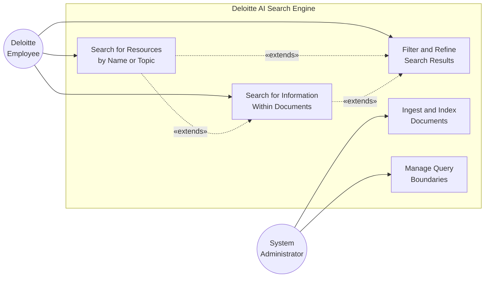
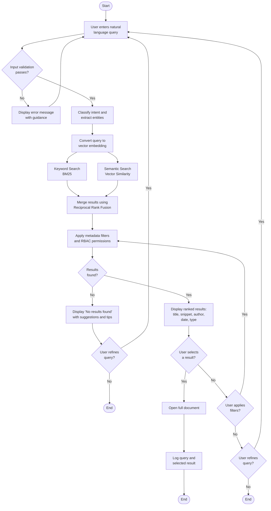
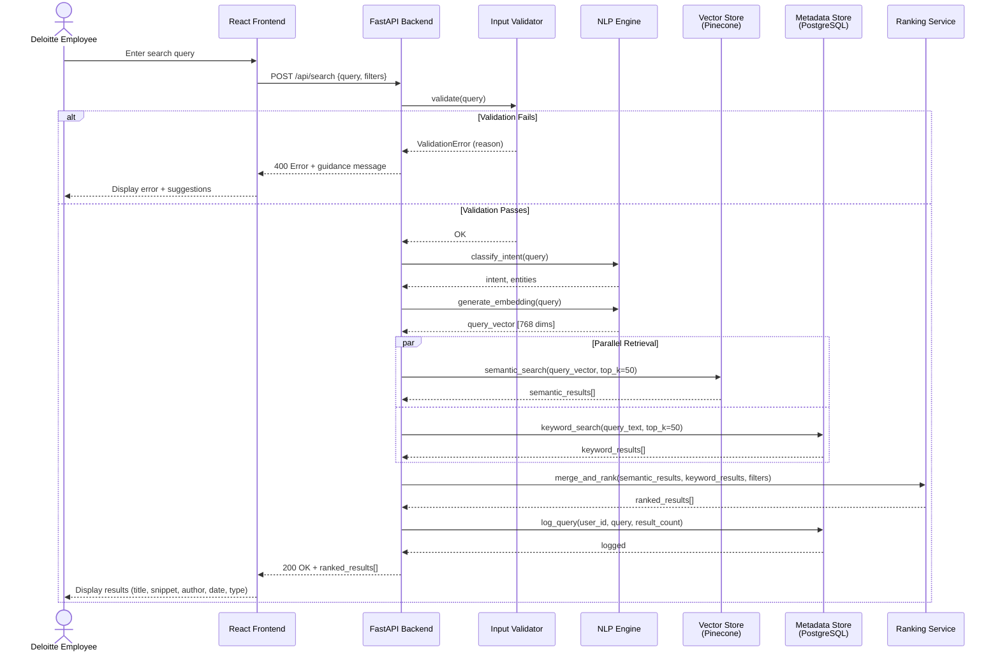
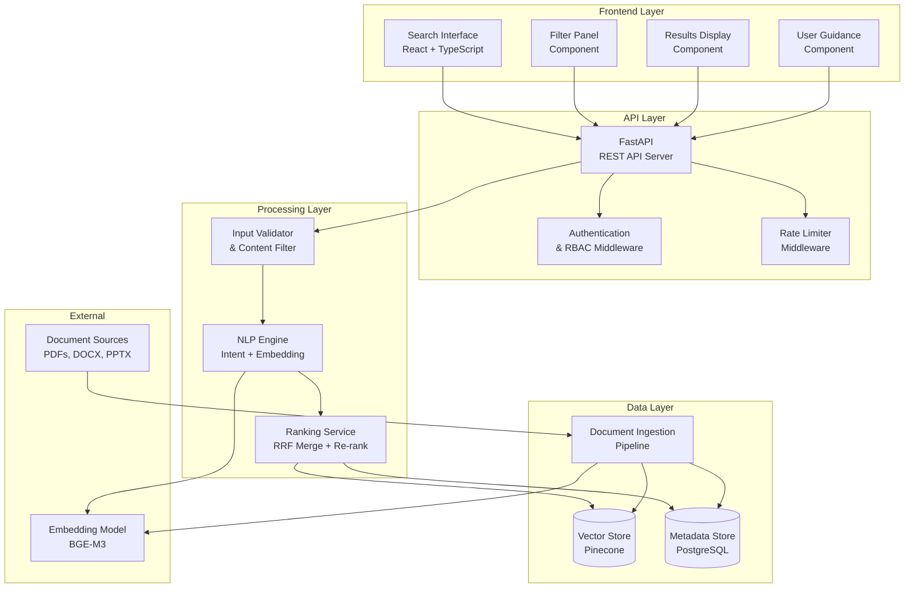
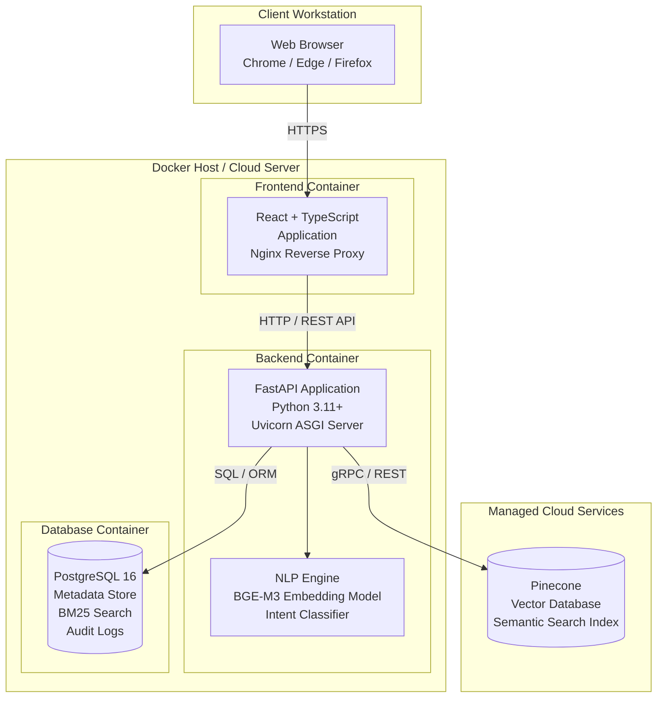

# Software Design and Engineering

**AI-Driven Company-Wide Search Engine for Deloitte Resources**

Group Two: Jesse Gabriel, Andrew Jung, Raven Levitt, Felix Tian, Sophia Turnbow, Matthew Voynovich

Information Technology Capstone — ITWS 4100

Professor Richard Plotka

Spring 2026

---

## 1. Introduction

This document describes the software design and engineering specifications for the AI-Driven Company-Wide Search Engine being developed for Deloitte. The system is a web application that enables Deloitte employees to search across internal resources—documents, policies, slide decks, and images—using natural language queries. It leverages Natural Language Processing (NLP) with hybrid retrieval (combining semantic search and keyword matching) to understand user intent and return relevant results even when the query wording does not exactly match the document text.

The software design follows standard UML modeling practices to describe the system's behavior, structure, and deployment. This section identifies core use cases, specifies the primary use case in detail, and provides Use Case, Activity, Sequence, Component, and Deployment diagrams.

---

## 2. Use Cases

Five use cases have been identified for the Deloitte AI Search Engine. These represent the primary interactions between users (Deloitte employees and system administrators) and the system.

### Use Case 1: Search for Resources by Name or Topic (Primary)

The core use case of the system. A Deloitte employee enters a natural language query into the search bar to locate a specific known resource (e.g., "Q4 healthcare consulting deck" or "travel reimbursement policy"). The system processes the query through input validation, intent classification, and entity extraction, then performs hybrid retrieval (semantic + keyword search) against the indexed resource database. Results are ranked by relevance and presented with title, snippet, author, date, and document type. The user can click on a result to access the document.

**Actors:** Deloitte Employee (primary)

**Trigger:** Employee needs to locate a specific internal resource by name, topic, or description.

### Use Case 2: Search for Information Within Documents

A Deloitte employee searches for a specific piece of information without knowing which document contains it. Rather than looking for a document by name, the user asks a content-level question (e.g., "What is Accenture's GAAP and non-GAAP EPS for the most recent quarterly earnings report?" or "What are the current billable hour thresholds for senior consultants?"). The system uses semantic search to identify document chunks whose content is most relevant to the query, then returns the source documents ranked by how well their internal content matches the question. Results highlight the relevant passage or section within each document, allowing the user to go directly to the answer rather than reading entire files.

**Actors:** Deloitte Employee (primary)

**Trigger:** Employee needs a specific data point, fact, or policy detail but does not know which document contains it.

### Use Case 3: Filter and Refine Search Results

After performing an initial search, a user applies metadata filters to narrow down the result set. Available filters include document type (PDF, slide deck, policy document, image), date range, author, and department. The system re-ranks and redisplays results based on the applied filters without requiring a new query.

**Actors:** Deloitte Employee (primary)

**Trigger:** Initial search returns too many results or the user wants to scope results to a specific category.

### Use Case 4: Ingest and Index Documents

A system administrator uploads new documents (PDFs, Word files, slide decks) into the system. The ingestion pipeline extracts text and metadata, chunks long documents, generates vector embeddings, and stores both the metadata (in PostgreSQL) and embeddings (in the vector store) for future retrieval. Cross-referencing is maintained via unique document IDs.

**Actors:** System Administrator (primary)

**Trigger:** New company resources are made available and need to be searchable.

### Use Case 5: Manage Query Boundaries

A system administrator configures the rules governing what queries the engine can and cannot process. This includes setting input length limits, defining content filtering rules (blocking profanity, PII, prompt injection patterns), enabling or disabling specific query types, and configuring rate limits. Changes take effect immediately and are logged for audit purposes.

**Actors:** System Administrator (primary)

**Trigger:** Security policy update or detection of query abuse patterns.

---

## 3. Use Case Specification: Search for Resources by Name or Topic

The following short-form use case template specifies the primary use case in detail.

| Field | Description |
|---|---|
| **Use Case** | UC1: Search for Resources by Name or Topic |
| **Scope** | Deloitte AI-Driven Search Engine Web Application |
| **Level** | User Goal |
| **Primary Actor** | Deloitte Employee |
| **Stakeholders and Interests** | **Deloitte Employee:** Wants to quickly find the most relevant internal resource without knowing its exact title, location, or platform. **System Administrator:** Wants search queries to stay within defined boundaries and not expose sensitive data or exploit the NLP models. **Deloitte Management:** Wants employees to spend less time searching and more time on billable work, improving overall productivity. |
| **Preconditions** | The user has access to the search engine web application. The resource database has been populated with indexed documents. |
| **Success Guarantee (Postconditions)** | The user is presented with a ranked list of relevant resources matching their query intent. The query and its results are logged for analytics. |
| **Main Success Scenario** | 1. The user navigates to the search engine web application. 2. The user enters a natural language query into the search bar (e.g., "digital transformation client pitch deck Q3"). 3. The system validates the input (length, language, content filtering). 4. The system classifies the user's intent and extracts entities (topic, time period, document type). 5. The system converts the query into a vector embedding. 6. The system performs hybrid retrieval: keyword search (BM25) and semantic search (vector cosine similarity) run in parallel. 7. The system merges and re-ranks results using Reciprocal Rank Fusion, applying metadata signals (recency, document type). 8. The system returns a ranked list displaying each result's title, snippet, author, date, document type, and relevance indicator. 9. The user clicks on a result to access the full document. 10. The system logs the query and the selected result. |
| **Extensions (Alternate Flows)** | **3a. Input validation fails:** The system displays a specific error message (e.g., "Query too long," "Please search in English," or "Your query could not be processed"). The user is prompted to reformulate their query. **6a. Zero results returned:** The system displays a "No results found" message along with contextual suggestions (e.g., "Did you mean…?" corrections, related search terms, or tips for broadening the query). **6b. Low-relevance results:** The system displays results with a note encouraging the user to try filters or rephrase their query, and provides query refinement suggestions. **8a. Rate limit exceeded:** The system informs the user that they have exceeded the query limit and should try again shortly. |
| **Special Requirements** | Query response time should be under 2 seconds for 95% of queries. The system must support concurrent queries from multiple users. All queries must be logged with timestamps for audit compliance. |
| **Technology and Data Variations** | Queries may include free-form text, partial phrases, or questions. Documents in the index include PDFs, Word documents, PowerPoint slide decks, and images with extracted text (OCR). |

---

## 4. Use Case Diagram

The Use Case Diagram below shows the interactions between the two primary actors (Deloitte Employee and System Administrator) and the five identified use cases. "Search for Information Within Documents" extends the resource search since both share the same retrieval pipeline but differ in intent (finding a document vs. finding content inside a document). "Filter and Refine Results" also extends the search use cases as an optional post-search step.

**Description:** The Deloitte Employee interacts with the system through three use cases: searching for a known resource by name or topic (UC1), searching for specific information contained within documents without knowing the source (UC2), and filtering/refining results from either search type (UC3). UC2 extends UC1 because both use the same hybrid retrieval pipeline but UC2 emphasizes chunk-level content matching and passage highlighting rather than document-level matching. UC3 extends both UC1 and UC2 as an optional post-search step. The System Administrator manages backend operations: ingesting documents into the searchable index (UC4) and configuring query boundaries and security rules (UC5).

---

## 5. Activity Diagram: Search for Resources

The Activity Diagram models the workflow of the "Search for Resources" use case, showing the sequence of actions from query entry to result display, including decision points for validation and result quality.

**Description:** The activity begins when a Deloitte employee enters a query. The system first validates the input—rejecting queries that violate length limits, language constraints, or content policies—and provides guidance for reformulation. Valid queries proceed through intent classification, embedding generation, and parallel hybrid retrieval (keyword + semantic). Results are merged via Reciprocal Rank Fusion, filtered by metadata and RBAC permissions, and displayed to the user. If no results are found, the system offers suggestions. The user may refine the query, apply filters, or select a result to view the full document. All interactions are logged.

---

## 6. Sequence Diagram: Search for Resources

The Sequence Diagram shows the object-level interactions that occur when a user performs a search, illustrating the messages exchanged between the frontend, backend API, NLP engine, vector store, metadata store, and ranking service.

**Description:** The sequence begins when the user enters a query in the React frontend, which sends an HTTP POST request to the FastAPI backend. The backend first validates the input through the Input Validator. If validation fails, an error with guidance is returned to the user. On success, the backend calls the NLP Engine to classify the user's intent and generate a vector embedding of the query. Two retrieval paths execute in parallel: the Vector Store (Pinecone) performs semantic similarity search while the Metadata Store (PostgreSQL) performs BM25 keyword search. Both result sets are passed to the Ranking Service, which merges them using Reciprocal Rank Fusion and applies any metadata filters. The ranked results are returned to the frontend for display. The query is logged in PostgreSQL for analytics and audit purposes.

---

## 7. Component Diagram

The Component Diagram shows the high-level software components of the system and their dependencies.

**Description:** The system is organized into four layers. The **Frontend Layer** consists of React + TypeScript components: the Search Interface (main search bar), Filter Panel (metadata filtering), Results Display (ranked results with metadata), and User Guidance (tips, suggestions, "Did you mean?" corrections). The **API Layer** is a FastAPI REST server with Authentication/RBAC middleware that enforces access controls and a Rate Limiter to prevent abuse. The **Processing Layer** contains the Input Validator (enforcing query boundaries—length limits, language, PII blocking, prompt injection detection), the NLP Engine (intent classification + embedding generation using the BGE-M3 model), and the Ranking Service (Reciprocal Rank Fusion of keyword and semantic results). The **Data Layer** includes the Vector Store (Pinecone, for semantic search over document embeddings), the Metadata Store (PostgreSQL, for structured metadata, keyword search via BM25, and audit logs), and the Document Ingestion Pipeline (which parses incoming documents, extracts text and metadata, chunks content, generates embeddings, and stores everything with cross-referenced document IDs).

---

## 8. Deployment Diagram

The Deployment Diagram shows the physical architecture—how software components are deployed across hardware nodes and how they communicate.

**Description:** The deployment architecture uses Docker containers for reproducibility and cloud-readiness. The **Client Workstation** runs a standard web browser accessing the application over HTTPS. The **Docker Host** (which can be deployed to any cloud provider) runs three containers: (1) the **Frontend Container** serves the React + TypeScript application through an Nginx reverse proxy that handles static assets and routes API calls; (2) the **Backend Container** runs the FastAPI application on a Uvicorn ASGI server with the NLP Engine (BGE-M3 embedding model and intent classifier) loaded in-process for low-latency inference; (3) the **Database Container** runs PostgreSQL 16, which stores document metadata, supports BM25 keyword search, and maintains audit logs. The **Vector Store** (Pinecone) is deployed as a managed cloud service, providing optimized semantic search over document embeddings with low query latency. Communication between the frontend and backend uses REST API calls. The backend communicates with PostgreSQL via SQL/ORM and with Pinecone via its REST/gRPC API.

---

## 9. Summary

This software engineering specification defines the design of the Deloitte AI-Driven Search Engine through five use cases, a detailed specification of the primary "Search for Resources" use case, and five UML diagrams. The system's architecture reflects the technical requirements outlined in Deloitte's project brief: a user-friendly search application with NLP-powered intent understanding, clearly defined query boundaries, built-in user guidance, and a searchable resource database. The component and deployment diagrams demonstrate a clean separation of concerns across the frontend, API, processing, and data layers, with Docker containerization ensuring a reproducible and cloud-ready deployment.
